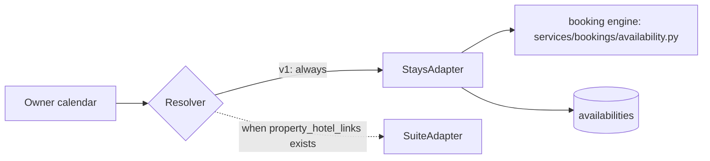

# Aparte: Owner Home (Stays) · Build Spec v1.1

2026-09-19 · Owner: Pamilerin (CTO) · Canonical: `admin-dashboard/docs/owner-home-spec.md`, mirrored in `api-v1/docs/owner-home-spec.md`

v1.1 is v1 checked against the code on `api-v1@dev` (7bac57a) and `admin-dashboard@staging` (49aa674). Section 0 lists every change and why. Where this document and the v1 prototype disagree, this document wins; the prototype remains the tiebreaker on layout only.

## 0. What changed from v1, and why

| # | v1 said | The code says | v1.1 does |
| --- | --- | --- | --- |
| A1 | Owner money settles after checkout plus a settlement window | No settlement window exists. `process_booking_split` credits the owner 10% of base when payment confirms the booking and 80% at check-in, which is a manual action. Nothing happens at checkout. The whole wallet is withdrawable | The money card mirrors real payouts (section 4). The big figure is what the owner can withdraw now |
| A2 | Statement is a ReportLab renderer | The statement is Jinja HTML printed by Playwright (`services/reporting/render_html.py`). ReportLab only renders the booking receipt | Section 4 names the real renderer |
| A3 | Page and statement reconcile to the kobo | They cannot today. The split pays `round(0.1b) + round(0.8b)`, the statement shows `b - round(0.1b)`; the statement shows offline bookings as earned with a fee never taken; it omits the 10% an owner keeps on a cancellation | One shared owner-share helper is called by the split, the page and the statement. M1 fixes the statement drift |
| A4 | `property_hotel_links` table and a Suite adapter | Neither exists | Build the adapter interface and the Stays adapter only. The resolver always answers Stays until the table exists |
| A5 | `blocked_by_type` discriminator already anticipated | Not present. The table has a free-text `source` column (`APARTE_BOOKING` default, `EXTERNAL_ICAL` for imports), one row per unit per date, and no block id | Reuse `source` with two new values; add `block_group_id` as the reopen handle (section 6) |
| A6 | Closing a night pushes to channels through the existing sync path | Sync is pull only, and the outbound iCal feed exports bookings, never blackouts | M4 adds owner blocks to the outbound feed. Until then the claim is false |
| A7 | One calendar entry per unit per night | A unit is a unit type with a room `count`; a night can be 2 of 5 rooms booked | Close-nights is for single-room units only. Multi-room units render read only (section 8) |
| A8 | Urgent example: a guest cancellation the owner must answer before a policy applies | There are no cancellation policies (refund is a flat 80%) and admins, not owners, decide cancellations | Real urgent sources are booking requests (24h expiry) and check-ins that are due (section 7) |
| A9 | Agent panel shows guest spend and owner share | An owner must never be able to see or derive what an agent makes | The panel shows bookings and what the owner earned, never guest spend. Every owner figure is built from `rent_base` (D13) |
| A10 | Agent attribution joins bookings on `assigned_agent` | `assigned_agent` is not stored on the booking, so reassigning a property rewrites history | Reuse the attribution rule the agent performance reports already use (D16) |
| A11 | Share pill reads `GET /links/catalog/me` | The endpoint is `GET /api/v1/links/catalogs/me` (plural). Its `property_count` counts verified, published listings only | Corrected |
| A12 | NGN rule is CI-enforced | Only the api-v1 statement tests enforce it. The dashboard has 33 literal naira symbols across 17 files and no check | A scoped lint rule enforces it on this page (section 10) |
| A13 | Fraunces figures, Plus Jakarta text, light and dark themes | The dashboard uses its own font, has no dark mode, and loads neither typeface | v1 ships in the dashboard font, light only, with colour tokens as CSS variables so dark is additive later |
| A14 | One engineering week | Items A1 to A7 add real backend work | About 2.5 weeks. Per section 14 the cut order is M5, then M4 |

The contradictory figures on today's page have a simpler root cause than design: the dashboard reads `lastMonthAmount` and `lastMonthTotal` from `/stats`, which has returned `currentMonthAmount` and friends since 2026-01-31, so every amount falls back to zero. Admin and agent roles keep that row after this rebuild, so it is fixed separately.

## 1. Purpose and scope

The owner home is the page an owner lands on at login, and today it answers none of the three questions an owner actually has. It also shows figures that contradict each other: a wallet balance above one and a half million naira beside a total revenue of zero, a listing count of zero beside a link card badged one listing, and three of four cards reading minus one hundred percent in red. This rebuild replaces that page.

An owner opens this page to ask, in this order: when am I getting paid, what is happening in my places, and is anything waiting on me. Everything on the page serves one of those three. Nothing else goes on it.

This is also a deliberate precursor to Aparte Suite. Two pieces carry forward: the money computation shared with the statement renderer, and the calendar source adapter seam. Both are cheap to build correctly now and expensive to retrofit. The rest of the page is disposable.

It is not a mini PMS, not an analytics surface and not a place to browse.

Surface is `dashboard.aparte.ng`, Next.js 15 admin dashboard, owner role only. Admin and agent homes are untouched. Mobile is the primary target.

## 2. Decisions

D1 to D12 stand as written in v1, with D11 and D12 clarified below. D13 to D17 are new in v1.1. Do not reopen these in build; raise new evidence in section 15.

| # | Decision | Why |
| --- | --- | --- |
| D1 | Two summary cards, Money and Bookings. The four-card row is deleted | Three of four cards are structurally zero at current scale |
| D2 | No percentage-change deltas anywhere | A minus one hundred percent on a zero base reads as failure |
| D3 | No side rail on this page | The calendar wants the width |
| D4 | The calendar is the main object, tabbed by listing | It is where the second question lives and the only surface that accepts a write |
| D5 | Tap is the interaction; hover is a desktop convenience only | Owners are on phones |
| D6 | Time-critical items render above the calendar, everything else below | A deadline under a month grid is invisible on a phone |
| D7 | Closing a night records occupancy, never money | Recording amounts builds the button that routes revenue around the fee |
| D8 | Share sits at three volumes: header pill, nav destination, contextual prompt | The need is not permanent |
| D9 | The agent panel earns its place on attribution, not contact | Bookings produced change an owner decision; contact alone is thin |
| D10 | Bookings card counts stays arriving in the next 30 days | A lifetime counter only goes up |
| D11 | Platform fee is presented as a single 10 percent figure, never decomposed | The statement already prints "Platform fee, 10%". Internally that 10 percent is shared between the platform, the listing agent and the referrer; the owner never sees the parts |
| D12 | NGN written in full, never the symbol | Standing rule. Enforced on this page by a scoped lint rule (section 10) |
| D13 | **An owner never sees, or can derive, what an agent makes.** Every owner-facing amount is built from `rent_base = total_price - caution_fee - agent_custom_fee`, never from `total_price` | `total_price` includes the agent's own markup, so any owner figure built on it lets the owner subtract and recover the agent's cut |
| D14 | The money card's big figure is the owner's NGN wallet balance: what they can withdraw now | That is the only figure that matches the wallet page and the withdraw button. A smaller "settled" figure beside a larger withdrawable balance is the contradiction this page exists to remove |
| D15 | Close-nights is available on single-room units only in v1 | A night on a multi-room unit type is a fraction, not a state |
| D16 | Agent attribution uses the existing rule in `services/statistics/agent_performance_service.py`: assigned agent, then the booking's referrer, then the guest's signup referrer | One definition of "this agent's bookings" across the owner page and the agent reports |
| D17 | Light theme only in v1, in the dashboard's own font | The dashboard has no dark mode; one dark page inside a light shell is worse than none |

## 3. Page anatomy

Six elements, rendered in this order, single column, max width 1080px.

**Header row.** Date on the left, share pill on the right. The pill holds the owner's catalog handle, a Copy button and a QR button. It is always present and never grows. Below 660px it drops to full width under the date. If the owner has not claimed a handle, the pill reads "Claim your page" and links to the existing claim flow.

**Money card.** Big figure is the NGN wallet balance, labelled ready to withdraw. Subline names the next amount that becomes withdrawable, the guest and the day, and the event that releases it, which is check-in. Two footer links: Withdraw, and See every payment. When the balance is zero and nothing is clearing, the card does not print a zero; it explains how payouts work in one sentence (section 9) with one link.

**Bookings card.** Big figure is the count of stays arriving in the next 30 days. Subline names the next arrival by guest and unit. Two footer links: See all bookings, and Who is in right now. When the count is zero the figure becomes open nights over the same window, and the single link becomes Share my page.

**Urgent bar.** Renders only when at least one action carries a deadline inside 48 hours. Amber, one line, one button. Multiple urgent items collapse to the nearest deadline with a count.

**Calendar.** Listing tabs, month navigation, month grid, legend, then a contextual share prompt. Sections 5, 6 and 8.

**Next actions.** Everything waiting on the owner that is not urgent. Empty state is a single line, not a hidden panel.

**Agents.** Full width, one row per agent: name and places covered, bookings in 90 days, what the owner earned from those bookings, last booking date, and Call and WhatsApp handoffs. No guest spend, no agent earnings, no tier. An agent with no booking in 60 days renders the date in amber.

Copy rules: sentence case throughout, no all-caps labels, no percentage deltas, no exclamation. The word is closed, never blocked. Empty states state the next action rather than the absence. Money copy never uses "10%" except for the platform fee, because the owner's transaction history already labels the first instalment "Booking revenue (10%)".

## 4. Money truth

The page and the statement read from one function, and that function, the statement and the wallet split all read owner share from one helper. This is the single most important constraint in the spec.

### How owners are actually paid

`process_booking_split` in `services/finances/services.py` pays the owner 90 percent of `rent_base` in two instalments:

| Instalment | When | Amount |
| --- | --- | --- |
| Initial | When payment confirms the booking | 10 percent of `rent_base` |
| Check-in | When someone presses check-in, on or after the start date | 80 percent of `rent_base` |

Nothing is credited at checkout. Between confirmation and check-in the 80 percent is held without a ledger row. Offline bookings (cash, POS, bank transfer) are never split, because the host collects that money directly. Extensions are paid their 90 percent in one go when the extension is paid.

### The shared helper

Extract the owner-share arithmetic from the split into `services/finances/owner_share.py`:

```python
def owner_share_parts(rent_base: Decimal) -> tuple[Decimal, Decimal]:
    """(initial, checkin), each rounded exactly as the split credits them."""
```

`process_booking_split`, `owner_earnings.compute` and the statement all call it. The platform fee shown to the owner is `rent_base - (initial + checkin)`, so `gross - fee == share` holds to the kobo by construction, and `share` equals what the ledger credited.

### The computation

`api-v1/services/reporting/owner_earnings.py` exposes `compute(owner_id, period) -> OwnerEarnings`. The statement renderer and the home endpoint both call it; neither computes anything itself. A pull request that adds arithmetic on money in a route handler or in the frontend is rejected in review.

| Field | Definition |
| --- | --- |
| `ready` | The owner's NGN wallet balance. What they can withdraw now |
| `clearing` | Sum of the check-in instalment on the owner's CONFIRMED, online-paid, not-yet-checked-in bookings |
| `next_release_amount`, `next_release_date`, `next_release_guest` | The earliest of those bookings by start date |
| `period_gross` | Sum of `rent_base` for the period (the statement's "Guests paid") |
| `period_fee` | Sum of `rent_base - (initial + checkin)` for the period |

The owner's share of a period is `period_gross - period_fee`, derived and never stored.

Rules. `clearing` is always labelled as clearing and names check-in as its release event; it is never folded into `ready`. A clearing booking whose start date has passed but which is still CONFIRMED becomes a next action, "Check in Aisha to release NGN 320,000", because nothing releases until someone presses it. Every figure is NGN with a thousands separator and the currency written in full.

### Reconciliation

`test_home_matches_statement` asserts that for the same owner and period, the home endpoint's `period_gross`, `period_fee` and derived share equal the statement's. `test_owner_share_matches_split` asserts that the split credits exactly `owner_share_parts(rent_base)` for a set of awkward bases (for example 12,345.67). Both run in CI.

### Statement changes in M1

Moving the statement onto the helper changes some figures owners have already seen. Each is a correction:

1. Rounding follows the split, so statement and wallet agree to the kobo.
2. A cancelled booking shows the initial instalment the owner kept.
3. Confirmed bookings that have not checked in show their check-in instalment as clearing, not earned.
4. Offline (cash, POS, bank-transfer) bookings now charge NGN 0.00 platform fee and show the owner's full share. Decision confirmed 2026-09-20 (closes open decision 2, section 15): Aparte does not invoice hosts for offline bookings — the platform is free to use for these, and a fee applies only to bookings actually transacted on it. That money is real and shown (`total_offline_collected`, a new line on both statements) but is excluded from `total_owner_earnings` and the wallet-reconciling total: the split never runs for an offline booking, so nothing was ever credited, and the statement must not claim wallet money that isn't there. See `services/finances/owner_share.py::booking_split`.
5. The statement never itemises agent or referrer amounts, only the single platform fee (D11, D13). Its total currently subtracts agent and referrer terms; M1 verifies those are zero or folds them into the fee line.

Suite note: the Stays release trigger is check-in. The escrow-then-split flow in Suite releases on `channel.checked_in`. `compute` takes the trigger from the booking's product line rather than assuming one.

## 5. Calendar source adapter

The calendar never queries the availability table directly. It asks a resolver which source owns a unit's calendar and reads through that source's adapter. That seam is the forward-compatibility contract with Suite.



In v1 the resolver always returns the Stays adapter. `property_hotel_links` and the Suite adapter are not built; adding them later means adding a table, one resolver branch and one adapter, with no change to the UI or the response shape.

The Stays adapter reads occupancy from the booking engine in `services/bookings/availability.py`, not from the public availability endpoint, which omits extension holds and the whole-property rule. Response shape, one entry per unit per night:

```json
{
  "unit_id": "uuid",
  "date": "2026-09-20",
  "state": "OPEN | BOOKED | OWNER_HOLD | OFFLINE | EXTERNAL | PARTIAL",
  "writable": true,
  "rooms": { "booked": 0, "total": 1 },
  "block_group_id": null,
  "booking": {
    "id": "uuid", "reference": "APRT_BK_20260920_40244", "guest_name": "Aisha Bello",
    "nights": 5, "check_in": "2026-09-20", "check_out": "2026-09-25",
    "guest_paid": "400000.00", "platform_fee": "40000.00", "your_share": "360000.00",
    "agent_name": "Blessing Nwosu"
  }
}
```

`guest_paid` is `rent_base` (D13). The booking object never carries `total_price`, the agent's markup, commission, tier or any per-party split.

`EXTERNAL` is a night blocked by an imported iCal feed; it renders as booked elsewhere with the channel's summary and is not writable, since the next poll would re-block it. `PARTIAL` is a multi-room night with some rooms booked.

`writable` is the adapter's answer. It is false for past nights, `EXTERNAL`, `PARTIAL`, any unit with more than one room, and every Suite night once Suite exists. The frontend never decides this.

A stay occupies check-in for `nights` days; the checkout day is open. `end_date` is already exclusive throughout the booking engine and the iCal code, and a test pins it.

## 6. Closing nights

Tapping an open, writable night opens one modal with two reasons and a nights stepper. Both reasons have the same effect on availability and differ only in what they record.

| Reason shown to the owner | Stored `source` | What it means |
| --- | --- | --- |
| I am keeping it for myself | `OWNER_HOLD` | Repairs, family, the owner's own stay |
| Someone booked it another way | `OFFLINE_BOOKING` | A direct guest, a returning guest, another platform |

Storage uses the existing `availabilities` table, which holds one row per unit per date:

- `source` gains two values, `OWNER_HOLD` and `OFFLINE_BOOKING`, alongside `APARTE_BOOKING` and `EXTERNAL_ICAL`.
- A new nullable, indexed `block_group_id` UUID is shared by every row one close action writes. It is what reopen deletes by.
- The model declares `UniqueConstraint(unit_id, date)`, which production already enforces through an index, so tests match production.
- No parallel table.

The offline reason records the nights and nothing else. No amount, no guest name, no receipt, no wallet entry, no statement line. This is deliberate and is not an oversight to be corrected by a later ticket.

Write rules:

1. Maximum 30 nights per action.
2. Overlap with any booking-engine hold (including pending payment, request-to-book and extension holds) or an `EXTERNAL_ICAL` night is rejected with the conflicting dates named.
3. A close upserts rows in place and preserves any custom `pricing` on them. It does not go through `AvailabilityService.create_or_update_availability`, which overwrites pricing and ignores `source`.
4. Reopen clears `is_blackout`, `block_group_id` and the owner source, and is always permitted for both types.
5. Every close and reopen writes to `audit_logs` with owner, unit, range, type and device, via `AuditService.add_log` with keyword arguments only.
6. Channels: M4 changes `generate_outbound_feed` so that `OWNER_HOLD` and `OFFLINE_BOOKING` ranges are exported as events, grouped by `block_group_id` with stable UIDs. `EXTERNAL_ICAL` rows are never exported, or an imported block would echo back to the channel it came from. Channels see the change on their next poll.
7. M4 also fixes `apply_inbound_feed`, which today inserts a second row when a manual block already exists on that date. That breaks the unique index, and after three failed polls the feed is switched off. Closing nights would make that failure common.

## 7. Data contract

Six endpoints under `/api/v1/owner`, in a new `services/owner_home/` module. Every one filters on the authenticated owner and never accepts an owner id from the client. Every route is gated with `require_permission`: `owner_home.view` for reads and `owner_home.manage_calendar` for writes, fallback role OWNER, registered in `MIGRATED_RESOURCE_ACTIONS` and `MIGRATED_ROLE_GRANTS`. Responses are explicit Pydantic schemas that list their fields; no model is dumped whole.

| Endpoint | Method | Returns | Reads |
| --- | --- | --- | --- |
| `/home/summary` | GET | `ready`, `clearing`, `next_release_*`, `arrivals_30d`, `next_arrival`, `open_nights_30d` | `owner_earnings.compute`, bookings |
| `/calendar` | GET | Night states per unit. Params `from`, `to`, optional `property_id` | resolver and adapter, section 5 |
| `/calendar/blocks` | POST | Creates a block. Body `unit_id`, `start_date`, `nights`, `source`, optional `note` | `availabilities` |
| `/calendar/blocks/{block_group_id}` | DELETE | Reopens the nights | `availabilities` |
| `/actions` | GET | Ordered pending items, each with `kind`, `severity`, `deadline_at`, `title`, `detail`, `cta_label`, `cta_href` | see below |
| `/agents/performance` | GET | Per agent for a window, default 90 days: `name`, `places`, `bookings`, `you_earned`, `last_booking_at`, `phone` | bookings, D16 attribution |

The share pill reads the existing `GET /api/v1/links/catalogs/me`. Do not build a second source for the handle.

The home page makes exactly three calls on load: `/home/summary`, `/calendar` for the visible month, and `/actions`. Agents and further months load after first paint.

### Action sources

| Kind | Waiting on the owner when | Deadline | Severity |
| --- | --- | --- | --- |
| Booking request | Booking is `APPROVAL_PENDING` | `created_at + 24h` (the expiry job cancels it) | URGENT inside 48h, which is always |
| Check-in due | Booking is CONFIRMED and its start date is today or earlier | Start date | URGENT; it releases the owner's money |
| Extension request | Extension is `AWAITING_OWNER_APPROVAL` | None stored | Normal |
| Payout account | No verified payout account | None | Normal; copy is per owner, never per property |
| KYC | Not submitted, or rejected. `user_kycs` rows tell "never submitted" from "under review" | None | Normal |
| Discount proposal | A proposed discount policy awaits the owner | None | Normal |
| Calendar sync broken | An iCal feed on one of the owner's units is BROKEN | None | Normal |
| Dispute | Open dispute on a booking at the owner's property. Needs a new query through booking, unit and property; owners cannot see these today | None | Normal; information, admins decide |
| Statement ready | Last month's statement exists | None | Normal |

Cancellation requests are information only: admins approve them, there is no owner decision and no deadline. Reviews link to the reviews surface; there is no reply feature.

Severity is decided by the backend. The frontend does not compute it from timestamps.

## 8. Interaction

Every day cell is a real `button` element unless it is in the past, in which case it is an inert `div`. Every outcome is reachable by tap alone.

| Cell state | Tap opens | Hover shows |
| --- | --- | --- |
| Booked on Aparte | Stay detail: dates, nights, guest paid, platform fee, your share, agent name, reference, and two actions | Guest, nights, dates, your share, reference |
| Booked elsewhere (owner closed) | Range detail with a reopen action | Closed by you, booked elsewhere, nights |
| Booked elsewhere (channel sync) | Range detail naming the channel, no reopen | Synced from the channel, nights |
| Closed by owner | Range detail with a reopen action | Reason and nights |
| Open and writable | Close-nights modal, section 6 | Nothing; the cell shows a plus affordance |
| Multi-room night | Read-only breakdown: x of n rooms booked, with a link to the unit's availability editor | x of n booked |
| All-listings view | Per-night breakdown across units, read only | One line per unit |

Hover is suppressed under `@media (hover:none)`. No information exists only in a tooltip.

Tabs are per unit. The all-listings tab is the default when the owner has more than one unit and is read only. One unit renders no tab bar; two to five render tabs; six or more render a select.

Modals use the dashboard's Radix dialog, which traps focus, closes on Escape and scrim click, and returns focus to the originating cell. Below 520px they render as a bottom sheet with safe-area padding. The stepper is bounded at 1 and 30 nights, and the modal states the resulting range in words, including the day the unit is free again.

All writes are optimistic with rollback on failure and a single retry affordance.

## 9. States

No element ever headlines a zero.

| Condition | Money card | Bookings card | Calendar | Share |
| --- | --- | --- | --- | --- |
| Balance and arrivals present | Balance, next release in subline | Arrival count, next guest named | Normal | Pill only |
| Nothing withdrawable, money clearing | Clearing figure, labelled clearing, release on check-in named | Normal | Normal | Pill only |
| No bookings ever | "You are paid in two parts: a first share when a guest pays, the rest when they check in." One link: How payouts work | Open nights over 30 days | Empty month, all open | Prompt visible |
| Open nights above 60 percent of the month | Normal | Normal | Normal | Prompt visible |
| One unit | Normal | Normal | No tab bar | Pill only |
| Six or more units | Normal | Normal | Select instead of tabs | Pill only |
| No pending actions | Normal | Normal | Normal | Pill only |

The share prompt threshold is 60 percent open nights in the month being viewed, one tunable constant.

Next actions with nothing pending renders one line, `Nothing needs you today`.

Loading renders skeletons at the height of the real content. The calendar skeleton is a full month grid.

## 10. Non-functional floor

Performance is measured on a mid-range Android over 3G.

| Budget | Target |
| --- | --- |
| Time to first byte | Under 500ms at p50 |
| Largest contentful paint | Under 2.5s |
| Interaction to next paint on a day tap | Under 200ms |
| Route JavaScript, first load | Under 180KB gzipped |

- **Touch and layout.** Day cells are at least 44 by 44 CSS pixels, and the page has no horizontal scroll at 320px.
- **Viewport.** `src/app/layout.tsx` gains a `viewport` export with `viewportFit: "cover"`. Without it every existing `env(safe-area-inset-*)` in the dashboard, including the bottom navigation, resolves to zero on iOS.
- **Accessibility:**
  - every day cell carries an `aria-label` naming the date and its state;
  - the month grid is keyboard navigable with arrow keys;
  - focus is always visible;
  - colour never carries meaning alone;
  - contrast meets AA.
- **Visuals (D17).**
  - Light theme, dashboard font, teal `#028090` as the accent (already used across the dashboard).
  - The page's colours are CSS variables scoped to the owner home, so a dark theme is additive later.
- **NGN rule.** NGN is written in full in every figure, export and aria-label, through a `formatNgn` helper that outputs `NGN 1,530,000`. An ESLint `no-restricted-syntax` rule scoped to `src/components/owner-home/**` fails the build on the naira symbol.
- **Motion.** The page respects `prefers-reduced-motion`.

## 11. Instrumentation

Events ship with the feature through the dashboard's existing `trackEvent` helper (`src/lib/analytics.ts`), which fires in production only and only after consent.

| Event | Properties | Decision it feeds |
| --- | --- | --- |
| `owner_home_viewed` | listing\_count, has\_urgent | Whether this page is a lever at all |
| `owner_night_closed` | nights, source | The offline share |
| `owner_night_reopened` | nights, source | Whether closing is being used by mistake |
| `owner_stay_opened` | surface tap or hover | Whether the stay detail justifies its build |
| `owner_share_copied` | source pill, prompt or nav | Where share actually happens |
| `owner_statement_downloaded` | period | Whether the money block replaces the support question |
| `owner_withdrawal_started` | none | Whether the balance is trusted enough to act on |

No event carries an amount, a guest name or an owner id; GA4 and Clarity are not the place for them. Per-owner analysis runs on the database.

M0 baseline, before any code: owners with two or more logins in the last 60 days, as a share of owners with a live (verified, not deleted) listing. Password logins write an audit row, `"{ROLE} {name} successfully logged in."`; Google and phone logins may not, so the figure is a floor. If it is under a fifth, this page is not the lever and the weekly digest is the whole build.

Offline nights as a share of closed nights, per owner, at 60 days, now counts channel-synced (`EXTERNAL_ICAL`) nights alongside `OFFLINE_BOOKING`: both are occupancy that happened off Aparte, and the synced ones are the more reliable signal.

## 12. Risks

**Top failure mode: the page shows a money figure that disagrees with the wallet, the statement or the bank.** Mitigation is section 4 in full: one helper, one computation, and two reconciliation tests in CI. It lands in M1.

**Second: an owner derives what an agent makes.** Owners see agent attribution. If any owner figure were built on `total_price`, which includes the agent's markup, the owner could subtract and recover the agent's cut. Mitigation is D13: `rent_base` everywhere, allow-listed response schemas, and a test that walks every `/owner/*` response and fails on any key matching `agent_amount`, `commission`, `custom_fee`, `markup`, `tier` or `referrer_amount`.

**Third: the zero state.** Handled by section 9.

**Disintermediation.** Visible attribution plus a legitimate way to mark nights as taken elsewhere forms a complete off-ramp. For a single owner, agent-attributed bookings falling while offline nights rise over the same window is a detectable pattern. Build that reporting query on day one.

| Risk | Likelihood | Impact | Mitigation |
| --- | --- | --- | --- |
| Figures disagree with wallet or statement | Medium | Severe | Shared helper, reconciliation tests in CI |
| Owner derives agent earnings | Medium without D13 | High | `rent_base` only, allow-list schemas, key-walker test |
| Zero state reads as failure | High without section 9 | High | Never headline a zero |
| Owner and agent route around Aparte | Low now, rising | High | Reporting query on the falling-attribution, rising-offline signature |
| Owner hold still bookable on a channel | Certain without M4 | High | Outbound iCal exports owner blocks |
| Close breaks an iCal import | Likely without M4 | Medium | Inbound upsert fix ships with close-nights |
| Checkout-day off-by-one | Low | Medium | Engine is already end-exclusive; a test pins it |
| Nobody visits the page | High | High | The weekly digest; section 15 |

## 13. Out of scope for v1

Everything v1 listed, plus: the Suite adapter and `property_hotel_links`; closing nights on multi-room units; dark mode and the Fraunces and Plus Jakarta typefaces; review replies; any owner decision on cancellations.

The My link destination the header pill points at does not exist yet and is the next thing to spec.

## 14. Build sequence and kill criteria

About 2.5 engineering weeks. That is past the two-week line in v1, so the cut order stands: M5 first, then M4. If M4 is cut, it is cut whole: closing nights without the outbound iCal change would let an owner's own stay stay bookable on channels.

| Milestone | Contents | Done looks like |
| --- | --- | --- |
| M0 | Login-frequency baseline, section 11 | A number, before any code |
| M1 | `owner_share_parts`, `owner_earnings.compute`, statement refactored onto both, reconciliation tests | Split, page and statement agree to the kobo for the same period |
| M2 | `services/owner_home/`, permissions, `/home/summary`, the two cards in every section 9 state | No state anywhere headlines a zero |
| M3 | Resolver, Stays adapter, `/calendar`, read-only grid with tabs | Checkout day renders open; a multi-room unit renders read only |
| M4 | Migration, close-nights modal and endpoints, audit writes, outbound iCal export, inbound upsert fix | Close and reopen survive a reload, appear in `audit_logs`, and appear in the unit's outbound feed |
| M5 | Actions, urgent bar, agent attribution, share pill and prompt | Prompt appears above 60 percent open and stays quiet below |

Ship date, review dates and kill criteria are unchanged from v1: kill review on 2026-11-14 (fewer than 40 percent of owners with a live listing have opened the home twice and payment questions to Ann have not fallen); offline occupancy review on 2026-12-02; share prompt review on 2026-11-14. Proposed: the ship date moves from 2026-10-03 to 2026-10-10 unless M5 is cut. Confirm at kickoff.

## 15. Open decisions

1. **The offline button is the one effectively irreversible call.** Needs a deliberate yes from Adetunji. Unchanged from v1.
2. ~~**Offline bookings on the statement.**~~ **CLOSED 2026-09-20.** No invoice, no fee: hosts use the platform free for bookings paid directly to them, and are billed only on bookings transacted on the platform. See M1 §4 and `services/finances/owner_share.py::booking_split`.
3. **Data cleanup on owner and agent records** must land before or with M5. Owner: Shola. Unchanged from v1.
4. **Distribution.** A weekly owner digest deep-linking into this page. Unchanged from v1.
5. **Clearing before check-in.** v1.1 shows clearing with its release event named. Because check-in is a manual action, a guest who arrives but is never checked in holds the owner's money back. The check-in-due action mitigates this; whether check-in should also happen automatically on the start date is a separate finance decision.

## Appendix: implementation notes (build, 2026-09-19 to 2026-09-20)

Where the build differs from the sections above, and what a deploy needs.

**Open decision 2 closed 2026-09-20:** no fee, no invoice, on offline bookings — see M1 §4 and open decision 2. `services/finances/owner_share.py::booking_split(base, offline)` is now the one place that decides the fee for a booking's base; `booking_money` and the owner-home calendar's `booking_out` both call it. The statement and the `/owner/home/summary` "You earned" total both exclude offline money from the wallet-reconciling figure while still showing it, as `total_offline_collected`.

**Deploy steps, in order.**
1. Run the migration `owner_calendar_blocks_001` (adds `availabilities.block_group_id`; additive and idempotent).
2. Deploy the API.
3. Re-run `POST /api/v1/permissions/seed` (or `scripts/seed_role_permissions.py`). Until it runs, `owner_home.view` and `owner_home.manage_calendar` fall back to the OWNER role, which is the same answer, so the ordering is safe either way.
4. Deploy the dashboard.

**Calendar payload.** Bookings are returned once in a `bookings` list and each night references one by `booking_id`, rather than each night carrying a copy. A five-night stay otherwise repeats its whole booking object five times. Night states are the six in section 5 plus `CLOSED` (closed from the unit editor, or a capacity override of zero) and `UNAVAILABLE` (the whole-property interlock: the entire place is let, or a room inside it is).

**Reopening only affects future nights.** Past nights of a block stay closed and stay recorded, because they are the measurement section 11 depends on. Reopening a block that is entirely in the past answers 409.

**Legacy closed nights are not reopenable here.** Nights closed before this feature, or from the unit's own availability editor, have no `block_group_id`. They render as closed with `reopenable: false` and a line pointing at the unit's calendar.

**"Today" is Lagos time,** computed as UTC+1 with no daylight saving, so an owner's day rolls over when theirs does rather than at midnight UTC.

**Outbound iCal now exports closed nights,** owner blocks and manual blackouts alike, as "Not available", grouped into runs. Imported (`EXTERNAL_ICAL`) nights are never exported, or a channel would block itself with its own booking. The reason a night is closed is never exported.

**Known limits, accepted for v1.**
- **Closing a night and booking it are not serialised.** They write to different tables, so the `(unit, date)` index cannot arbitrate between them. The night is checked, written, then checked again before the commit, which narrows the window to the flush-to-commit gap without closing it. If it ever does happen, the calendar shows the night as booked with a note that it is also closed, rather than hiding the guest.
- **Two channels blocking the same night.** Only the first feed to claim a night owns the row. If that feed drops the event while the second still holds it, the night reopens on Aparte until the second feed's next poll, up to the poll interval. Closing this properly needs a per-feed record of claims.
- **Writes are not optimistic.** Closing a night waits for the round trip, against section 8. It is a small change to make later and was not worth the rollback complexity now.
- **Two queries stay unbounded**: the agent panel loads the owner's qualifying bookings to compute a 90-day window, and the cancellation check ORs one comment prefix per cancelled booking. Both are fine at an owner's scale and would need attention for an all-time report.

**A second money bug found while testing M1, fixed here.** A guest can extend a booking that has not checked in yet. Confirming an extension adds its amount to `booking.total_price` **and** pays the owner 90% of it immediately. The check-in stage then released 80% of the inflated total, paying that extension a second time: on a 100,000 stay with a 50,000 extension the owner received 175,000 against the 135,000 owed, out of funds the platform had already allocated. `process_booking_split` now computes the check-in instalment on the stay's own base, and `owner_earnings` does the same, so the page, the statement and the wallet agree. Covered by `tests/test_owner_earnings.py::test_an_extension_is_not_promised_again_at_check_in`.

**A bug found while building M4, fixed here.** `_parse_ical_events` imported `pytz` inside its per-event loop. `pytz` is not in `requirements.txt` and nothing installs it transitively, so in production every inbound event raised `ModuleNotFoundError`, was caught by the "skip malformed event" handler, and was dropped: **inbound calendar sync has never imported anything**, and each poll then deleted whatever that feed had imported before. Channel bookings were not blocking Aparte nights. Now on stdlib `zoneinfo`, and a calendar whose every event fails to parse raises instead of reading as an empty one, so it counts as a failed poll rather than silently wiping the feed's nights.

## Appendix: defects found during the review

These are not part of this build. Each gets its own branch.

1. **Security, verify first.** OWNER's default permission grants include `bookings.approve`, which gates `/approve-cancellation`. That route has no ownership check. If production's `role_permissions` matches the defaults, an owner can approve a cancellation and refund on any booking.
2. A second extension on the same booking pays nobody: the split's duplicate check reuses the parent booking's id.
3. Owners can already derive agent markup from existing surfaces: the receipt PDF's subtotal includes `agent_custom_fee`, and booking detail and list responses show `total_price` to owners.
4. Some audit rows are dropped silently: `add_log` receives `category=None` positionally in the booking cancellation path, and the column is not nullable.
5. The `/stats` field-name mismatch that zeroes the KPI row for every role.
